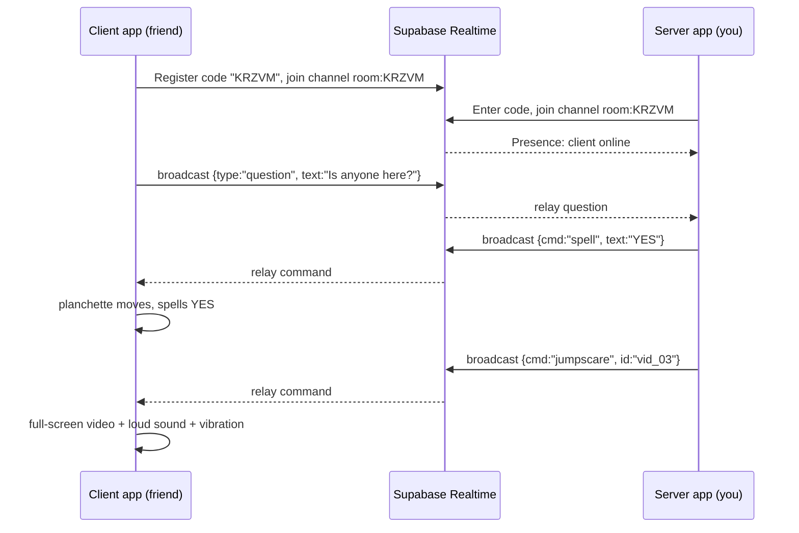

# Ouija Prank App — Requirements Document (v0.2)

## 1. Overview
One Android app, two modes:
- **Client mode** — the friend's phone. Shows a spooky, working Ouija board. Generates a 5-letter identity code on first launch.
- **Server (Controller) mode** — your phone. Enter the client's code, watch the client live, answer their questions through the planchette, and trigger scares (sudden sound, vibration, flashlight flicker, video jump scares, etc.).

**Goal:** give a friend a good, harmless scare by remotely controlling the Ouija board on their phone.

**Transport:** Supabase (free tier) Realtime. **Distribution:** sideloaded APK to friends (see §9 for why).

## 2. Architecture



- **Channel per code:** each 5-letter code = one Supabase Realtime channel (`room:<CODE>`).
- **Broadcast** carries commands and events (low latency, no DB writes). **Presence** shows online/offline and the client's device state.
- **Assets live in the client APK** (scare videos, sounds). Commands only send small IDs, so scares fire instantly and don't burn free-tier bandwidth.
- **Database (optional):** a `devices` table for code uniqueness and last-seen time.

## 3. Functional Requirements

### 3.1 Client Mode
- FR-C1: On first launch, generate a random **5-letter code** (A–Z, excluding easily confused letters such as I, O, L), check uniqueness against Supabase, and store it locally.
- FR-C2: Show the code clearly on a small "Share this code" screen, with a Regenerate option.
- FR-C3: Show a working Ouija board (A–Z, 0–9, YES, NO, GOODBYE) with a draggable planchette. It works standalone even when no controller is connected.
- FR-C4: Client can type a question. It is sent live to the server.
- FR-C5: Maintain a realtime connection with auto-reconnect. Queue nothing: commands received while offline are dropped.
- FR-C6: Execute received commands (see §4). Unknown commands are ignored safely.
- FR-C7: Report state to the server (see §5).
- FR-C8: Visible "connected" indicator and an **always-available Exit/Stop** control that kills all effects and disconnects (safety, see §7).

### 3.2 Server (Controller) Mode
- FR-S1: Enter a 5-letter code to connect. Show status: Connecting / Online / Offline.
- FR-S2: **Live view:** the client's planchette position, typed questions, current screen, battery, and device state.
- FR-S3: **Answer console:** type a reply, and the client's planchette spells it letter by letter, with adjustable speed and pauses. Quick buttons for YES / NO / GOODBYE.
- FR-S4: **Scare panel:** big buttons for every effect in §4, with sliders for intensity and duration.
- FR-S5: **Sequences/macros:** chain effects with timing (for example, lights flicker → whisper → wait 3 s → jump scare). Save and replay.
- FR-S6: Remember recent client codes and give them nicknames ("Rahul's phone").
- FR-S7: Cooldown between heavy scares (default 10 s) so you can't spam.
- FR-S8: **Panic/Stop button** that sends "stop all effects" to the client.

## 4. Remote Commands (Server → Client)

| Command | What happens on the client | Android API / permission |
|---|---|---|
| `vibrate` | Vibration with custom pattern and amplitude (short buzz, heartbeat, long rumble) | `Vibrator`/`VibratorManager`; `VIBRATE` (normal permission) |
| `sound` | Play a sound: whisper, knock, scream, door creak, laugh. Optional "sudden" mode (silence → loud hit) | `MediaPlayer`/Media3; volume capped (see §7) |
| `video` | Full-screen jump-scare video or image flash | Media3 ExoPlayer; bundled asset |
| `spell` | Planchette moves itself and spells a message | Compose animation |
| `move_planchette` | Planchette drifts or jerks to a position by itself | Compose animation |
| `flashlight` | Torch flicker pattern | `CameraManager.setTorchMode` (no camera permission needed) |
| `screen_flash` | Strobe, blackout, red flash, or "screen glitch" overlay | Compose overlay; window brightness within the app |
| `shake` | Screen shake or UI distortion / flicker | Compose animation |
| `tts` | Creepy voice reads text aloud, pitch lowered | `TextToSpeech` |
| `fake_ui` | In-app fake events: "battery 1%", cracked-screen overlay, "unknown presence connected" dialog | Compose overlay (in-app only) |
| `dim/lights_out` | Board goes dark; only the planchette glows | Compose |
| `stop_all` | Cancel everything immediately | — |

**Extra ideas to consider later:** haptic "footsteps" synced to sound; spectral face fades in behind the board for one frame; the board "refuses" to let the user drag the planchette (it snaps back); the "spirit" types the friend's own words back after a delay; a countdown timer overlay ("It's behind you… 10, 9…").

## 5. Client → Server Telemetry (opt-in by design, in-app only)
Sent so you can time your scares well:
- Online/offline and last-seen (Presence)
- Current screen (board / settings / video playing)
- Planchette position and letter currently selected
- Typed questions and any Ouija messages
- Battery level and charging state
- Whether the phone is being handled (accelerometer motion) or lying still
- Ambient light level (dark room = better scare) and proximity (in pocket or not)
- Media volume level and whether headphones are connected (helps you avoid a painful scare)

**Deliberately excluded:** camera, microphone, location, contacts, files, notifications, other apps. This is a prank app, not spyware.

## 6. Non-Functional Requirements
| Area | Requirement |
|---|---|
| Latency | Command-to-effect under ~500 ms on normal mobile data or Wi-Fi |
| Reliability | Auto-reconnect; heartbeat (Presence); graceful handling of dropped connections |
| UI/Theme | Dark, gothic, mysterious: aged wood board, candle glow, film grain, fog, custom horror-style font, subtle idle animations |
| Compatibility | minSdk 26 (Android 8.0); phones first |
| Performance | 60 fps board; videos pre-loaded so the scare has no lag |
| Battery | No background services in v1; connection only while the app is in the foreground |
| Size | Bundle compressed assets; aim for under ~80 MB total |
| Security | See §8 |

## 7. Safety & Consent (required)
A remote-scare app is only okay when the friend knows what they've installed and can always get out.
- **Consent by design:** the friend installs the app and starts client mode themselves. It never runs hidden, never has a disguised icon, and never runs in the background.
- **Always-available exit:** persistent Stop control; closing the app ends the session and all effects.
- **Volume cap:** max sound level limited (default ~70% of media volume) and a **fade-in floor** so a sudden sound can't blast at 100%. Detect headphones/earbuds and lower the cap further.
- **Photosensitivity:** flash/strobe limited to under 3 flashes per second, with a "reduce flashing" client setting.
- **Intensity limits:** cooldown between scares; no more than N heavy scares per session.
- **Not for everyone:** don't use on anyone with a heart condition, seizure history, or anxiety issues, or on kids. Add a first-run "This app is a prank/horror game — have fun, stop anytime" screen on the client that doesn't give away the pranks.
- **Session end:** a "GOODBYE" letter or "Reveal prank" button lets the friend know it was you (optional reveal screen).

## 8. Backend: Supabase Free Tier

**Services used:** Realtime (Broadcast + Presence), Auth (anonymous sign-in per device), Postgres (small `devices` table).

**Suggested setup**
1. Create a Supabase project and note the Project URL and `anon` public key (never ship the `service_role` key).
2. Enable **anonymous sign-ins** so each device gets a lightweight identity.
3. Create table `devices(code text primary key, created_at timestamptz, last_seen timestamptz)`, with RLS: a device may insert its own row; the controller may read.
4. Use **private Realtime channels** with Realtime Authorization (RLS policies on `realtime.messages`) so only the paired client and controller can join `room:<CODE>`.
5. Client generates the code and joins as "client"; the controller joins the same channel as "controller". Commands are only accepted from the controller role.

**Free-tier watch-outs (verify current limits on Supabase's pricing page):**
- Concurrent Realtime connections and monthly Realtime messages are capped (roughly 200 connections / 2M messages at the time of writing, plenty for a friend group).
- Free projects **pause after about a week of inactivity**. Open the dashboard or wake the project before a planned prank.
- Keep telemetry throttled (for example, planchette position at ≤ 10 updates/s, state every few seconds).
- Storage is small, so bundle videos in the APK instead of streaming.

**Security notes:** 5 letters are guessable (~6M combinations), so rely on private channels and role checks, and regenerate the code on demand. Never allow a third party to become a controller of someone else's client without that client's code.

## 9. Distribution
Because the controller can remotely trigger sounds, vibration, and video on another phone, Google Play policy review may treat this as remote-control/prank software. Simplest path for a friends-only prank: **sideload the APK** (or use Firebase App Distribution). If you later publish on Play, add clear disclosure, consent screens, and an entertainment disclaimer.

## 10. Android SDK & Prerequisites

**Development environment**
- **Android Studio** (latest stable) with the bundled **JDK 17** (JetBrains Runtime)
- **Android SDK Platform** for your target API (use the latest stable; check Play's current target-API requirement if you publish) plus **API 26** for minSdk testing
- **Android SDK Build-Tools**, **Platform-Tools (adb)**, and **Android Emulator** (via SDK Manager)
- **Gradle** with a current **Android Gradle Plugin** (Studio's upgrade assistant handles versions)
- **Kotlin** 2.x with the Compose compiler plugin

**Config**
- `minSdk = 26`, `compileSdk` and `targetSdk` = latest stable
- Language: Kotlin; UI: **Jetpack Compose** (Material 3, Canvas, gestures, animation)

**Libraries**
| Purpose | Library |
|---|---|
| Realtime, Auth, Postgrest | `supabase-kt` modules: `realtime-kt`, `auth-kt`, `postgrest-kt` (plus the BOM) |
| HTTP engine for supabase-kt | Ktor client (`ktor-client-okhttp` or `-android`) |
| JSON | `kotlinx-serialization` |
| Video/audio | AndroidX **Media3** ExoPlayer |
| Async | Kotlin Coroutines + Flow |
| Local storage | Jetpack DataStore |
| Navigation/UI state | Navigation Compose, ViewModel |
| Crash logs (optional) | Firebase Crashlytics |

**Manifest permissions:** `INTERNET`, `VIBRATE`, and (optionally) `ACCESS_NETWORK_STATE`. Torch, TTS, sensors (accelerometer, light, proximity), and audio volume control need no extra runtime permission for the features above.

**Accounts & tools:** a free Supabase account and project; a Git repo; **two devices** for testing. Vibration, torch, and sensors need a **physical phone** (emulators can't do them properly), so ideally one real device as the client and another (real or emulator) as the controller. A Google Play developer account is **not** needed for sideloading.

**Project structure suggestion:** single module with packages `ui/client`, `ui/server`, `core/realtime` (Supabase channel wrapper), `core/commands` (sealed command classes + JSON), `core/effects` (vibration, sound, torch, video handlers), `data`, `theme`.

## 11. Command Protocol (draft)
```json
{ "v": 1, "cmd": "vibrate", "id": "uuid", "ts": 1758350000,
  "args": { "pattern": [0, 300, 100, 500], "amplitude": 200 } }
```
- Versioned messages; the client ignores unknown commands and unknown fields.
- Each command carries an id for acknowledgement (`ack` / `error` events sent back to the server).

## 12. Milestones
| Phase | Scope | Est. |
|---|---|---|
| M0 | Supabase project, auth, channel + presence prototype (two phones exchanging "hello") | 3–4 days |
| M1 | Client: spooky board UI, planchette, code generation | 1–2 weeks |
| M2 | Server: connect by code, live view, answer console with spelling animation | 1 week |
| M3 | Effects: vibration, sound, torch, screen effects, video jump scare, TTS | 1–2 weeks |
| M4 | Telemetry, macros/sequences, safety limits, exit control | 1 week |
| M5 | Polish, sound design, device testing, APK build | 1 week |

## 13. Risks
- Free-tier project pausing before a prank → wake it ahead of time.
- Phone in background or asleep → no connection; v1 works only while the client app is open in the foreground (background push would need FCM).
- Guessable codes → private channels and role checks.
- Scares too intense (volume, strobe) → caps, cooldowns, and the Stop control.
- OEM battery restrictions and OS differences → test on 2–3 different phones.

## 14. Open Questions
1. Should the client need a prior "start session" tap, or auto-connect when the app opens?
2. Do you want a "reveal prank" screen at the end?
3. Which scare assets (videos and sounds)? Original, or licensed/royalty-free? Copyrighted clips can't be bundled or shared legally beyond private use.
4. Should one controller manage several clients at once?
5. Any need for background triggers (phone in pocket)? That means FCM and is a larger build.
